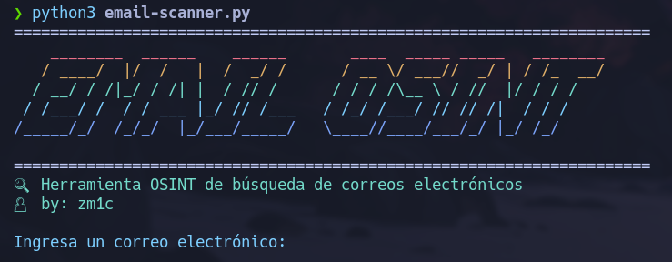

<h1 align="center">📧 Email OSINT Tool</h1>

<p align="center">
  Herramienta avanzada para recolectar información pública asociada a correos electrónicos.
</p>

<p align="center">
  
</p>

---

## 📚 Tabla de Contenidos

- [🎯 Descripción](#-descripción)
- [🚀 Características](#-características)
- [🛠️ Instalación](#️-instalación)
- [📦 Requisitos](#-requisitos)
- [🧪 Uso](#-uso)

---

## 🎯 Descripción

**Email OSINT Tool** es una herramienta de análisis e investigación OSINT enfocada en correos electrónicos. Permite identificar servicios en los que un correo está registrado, verificar su exposición en filtraciones y obtener datos relevantes para auditorías éticas o investigaciones de ciberseguridad.

---

## 🚀 Características

- 🔍 Integración con [Holehe](https://github.com/megadose/holehe) para análisis de servicios en línea.
- 🧠 Verificación de filtraciones en bases públicas.
- 🖼️ Interfaz en consola con arte ASCII y colores.
- 💡 Ideal para pentesters, analistas SOC y OSINT researchers.

---

## 🛠️ Instalación

Clona el repositorio:

```bash
git clone https://github.com/zm1c/email-osint.git
cd email-osint
